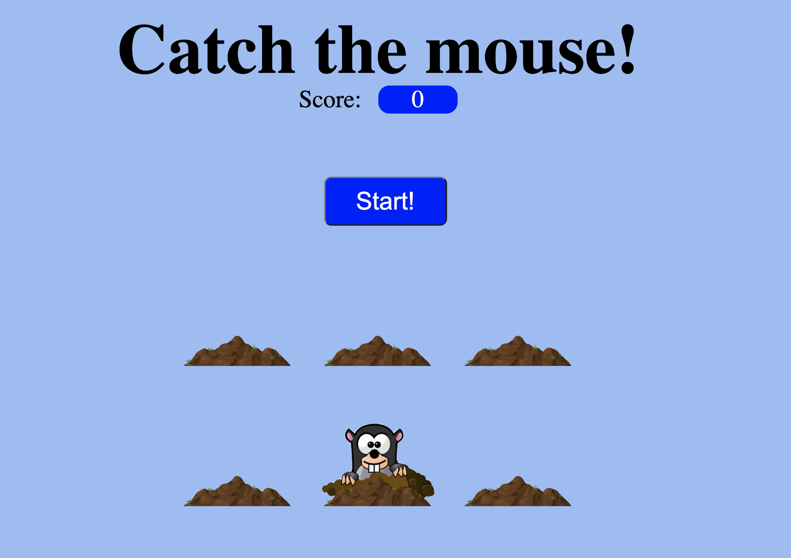
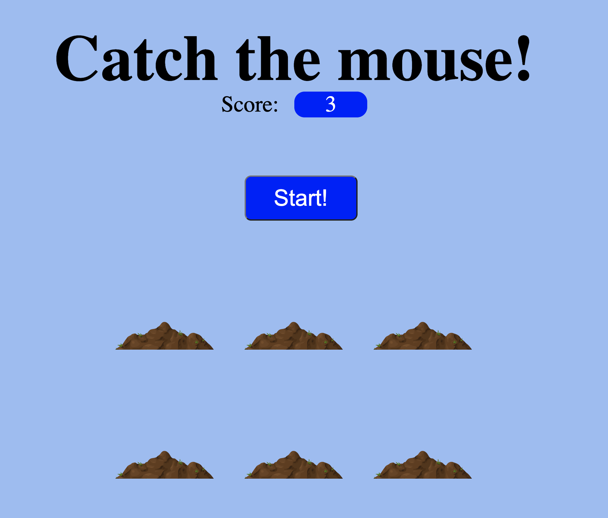

# Catch The Mouse
In this project you will be building `Catch the mouse` game. Where a mouse peeks from different holes and then hides quickly, you have to click on it to catch it. Keep score of how many times a user is able to catch the mouse. Game get's finished in 15s.

## Requirements

- A single game last for 15 seconds
- Catch the mouse by clicking on it
- Increase the score every time user catches it
- Mouse hides after 800ms

## Game GIF

## In Progress Game Screen

## With Score Game Screen

### Note
You can't use any third party libraries, you should be writing it in pure HTML, CSS and JS
